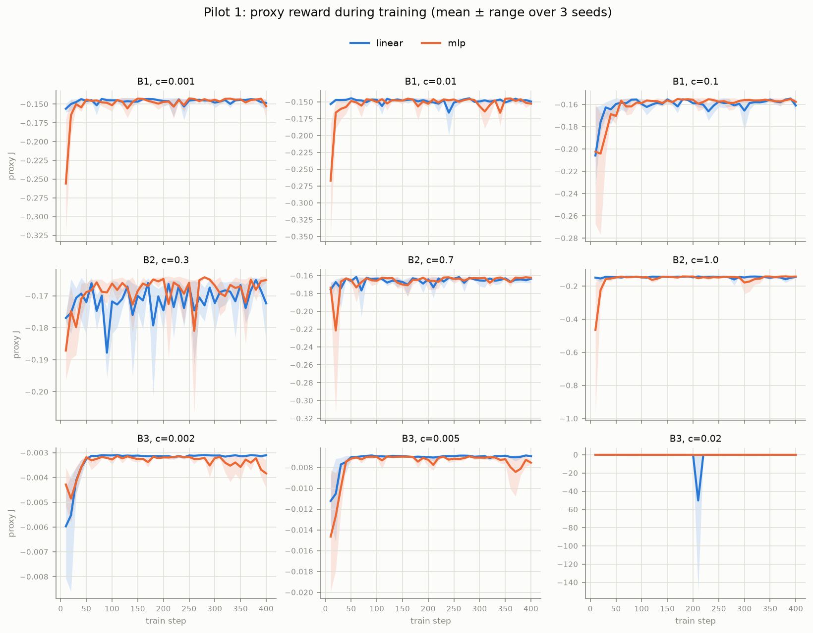
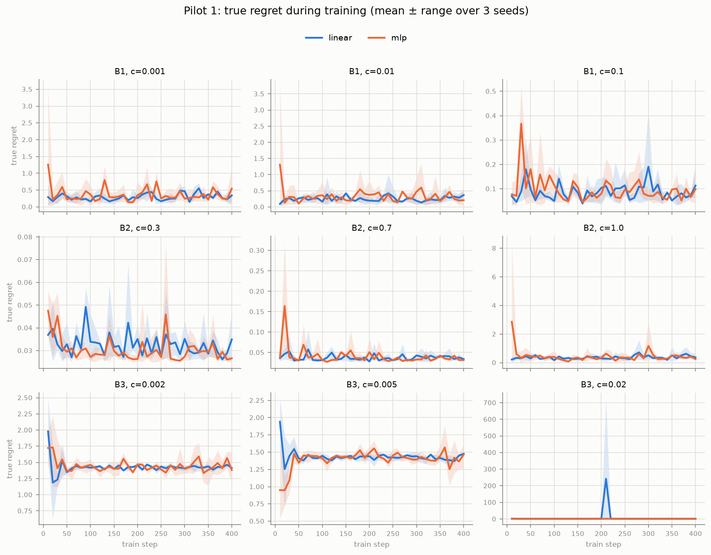
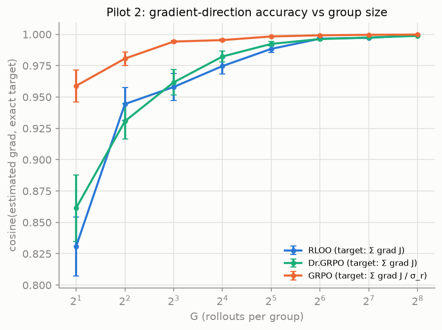
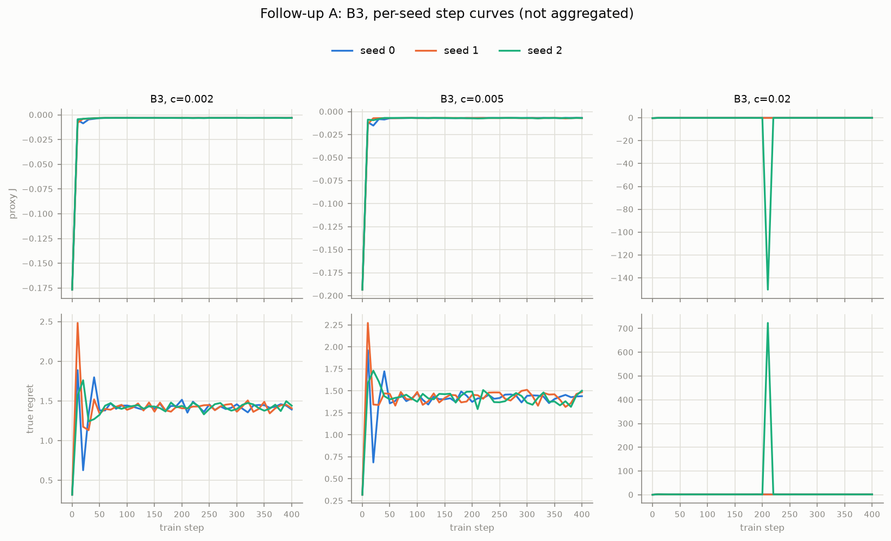
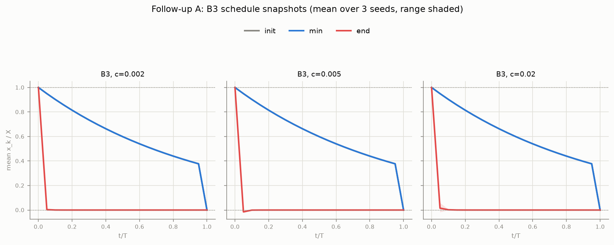
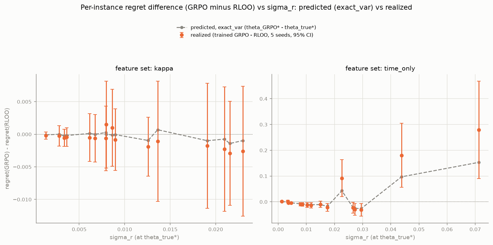
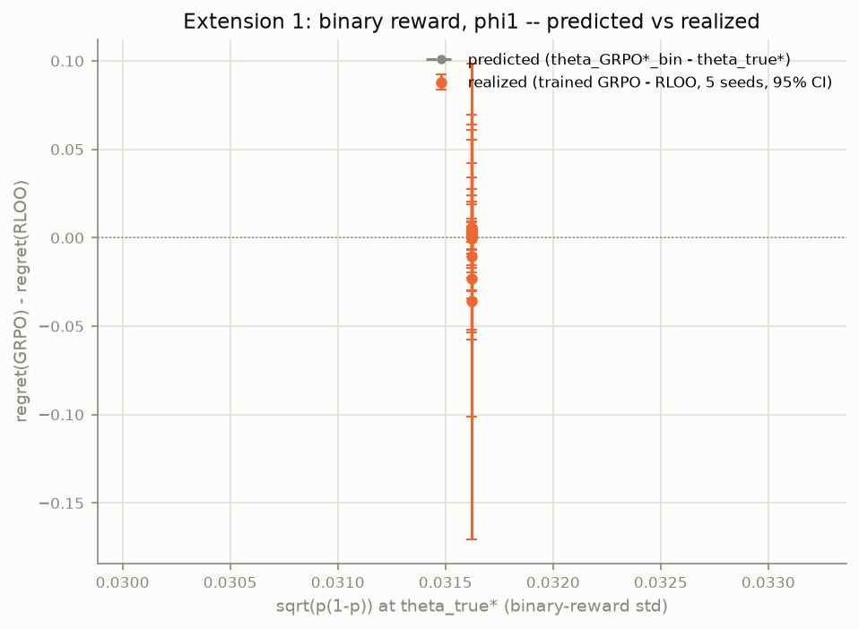
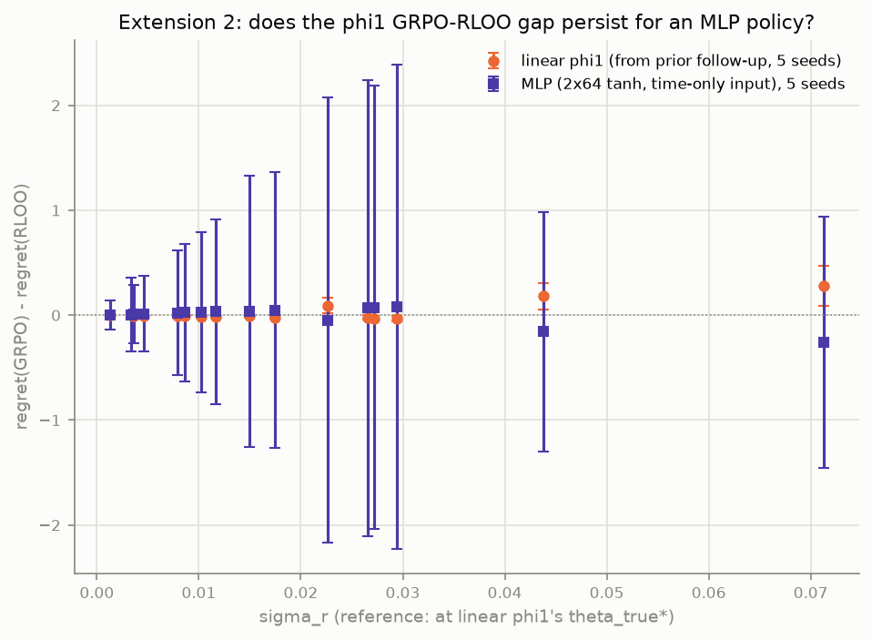
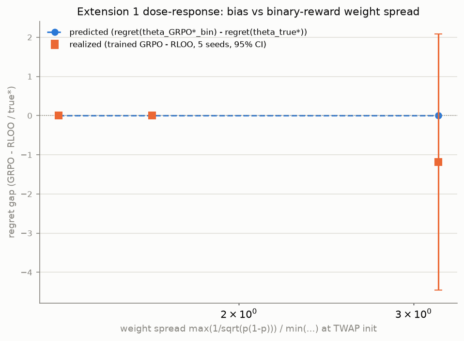
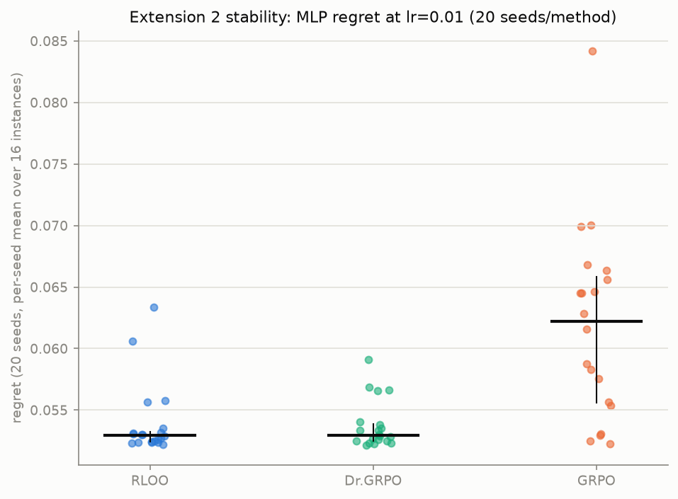

# Pilot report: Almgren-Chriss exact-oracle env, Goodhart curves, GRPO bias

## Pass/fail

- **Env (Section 2 tests): PASS.** All 6 tests in `tests/test_env.py` pass: exact_J vs
  1e5-rollout MC agrees within 3 SE (5 instances x 3 thetas); the AC closed form beats
  scipy-optimized free schedules by <=1e-6 relative gap (5 instances); autograd matches
  central finite differences (rtol 1e-4); Dr.GRPO's advantage equals exactly
  `(G-1)/G * RLOO`'s; RLOO's and GRPO's large-G mean gradients match their predicted
  targets (rel. error 6%, cosine 0.998).
- **P1 (Goodhart): YES**, but bug-dependent. Bug **B3** (impact cap) shows a sharp,
  seed-robust divergence in *every* (c, capacity) cell. Bug **B2** (cost lag) is a
  **clean negative** at weak/moderate c (0.3, 0.7) but diverges at the full bug (c=1.0).
  Bug **B1** (weak terminal penalty) is small and noisy — inconclusive.
- **P2 (GRPO bias): CLEAN NEGATIVE** with the spec's kappa-aware features. `theta_GRPO*`
  sits only 0.003-0.006 from `theta_true*`, far inside the training-seed noise floor.
- **Follow-up A (B3 is a real exploit, not numerics): YES.** The policy's mean trade
  fraction `m_k` ranges from -2.8 to +3.4 (far outside [0,1]), reached near-identically
  across all 3 seeds under uniformly-applied gradient clipping; true regret never improves
  before diverging (minimum is at step 0 in all 9 runs).
- **Follow-up B (trained endpoints match predicted proxy optima within seed spread): NO**
  for most configs (5/9 don't match within +/-1 trained-seed-SD; 4/9 do) — the shared,
  noisy, parametric RLOO policy doesn't fully realize the free per-instance deterministic
  exploit.
- **Follow-up C (misspecified-policy GRPO gap exceeds seed spread and GRPO tracks
  theta_GRPO*): YES at G=16, NO at G=4.** Removing the kappa feature (phi1: time-only,
  phi2: raw instance params without kappa) widens the predicted gap ~8x (0.027 vs 0.003)
  and it clears the G=16 seed-noise floor for both misspecified feature sets (not for the
  kappa control); GRPO endpoints track `theta_GRPO*` more closely than RLOO's in every
  case, most clearly at G=16.
- **Extension 1 (binary/RLVR reward, phi1): CLEAN NEGATIVE.** `theta_GRPO*_bin` sits only
  0.00015 from `theta_true*` (bounded Bernoulli variance `p(1-p) in [0,0.25]` gives only
  ~1.6x weight heterogeneity across instances, vs. ~20x for continuous `sigma_r`) —
  binarizing the reward structurally suppresses the bias even under the same instance-blind
  features that showed it clearly with continuous rewards.
- **Extension 2 (MLP policy, time-only input, continuous reward): INCONCLUSIVE at
  lr=0.05, but RESOLVED by Quick follow-up 2 below.** At the original lr=0.05, training
  noise swamped everything (pooled `regret(GRPO)-regret(RLOO)` 95% CI `[-1.07, 1.07]`); at
  a properly-scaled lr=0.01 (picked via a 3-value sweep) with 20 seeds/method, the gap
  reappears cleanly: bootstrap `regret(GRPO)-regret(RLOO)` = 0.0079, 95% CI
  `[0.0046, 0.0116]`, excluding zero.

## Setup notes

gamma=0 (permanent impact) and eps=0 (spread) only ever add a constant (eps x volume) or a
kink at n_k=0 to the reward, so they cannot change argmax(theta) and are omitted from every
reward expression in `env.py`. phi's non-intercept features are standardized with
population mean/std from 4000 sampled instances (fixed seed, per feature set). Policy
gradients use REINFORCE on the closed-form Gaussian log-density of the sampled
fraction-of-remaining actions (s=0.05 fixed, not learned); RLOO/Dr.GRPO/GRPO losses
average over the G rollouts within a group and sum over instances/prompts in the batch,
matching the spec's "unbiased for grad of sum_i J_i" framing for RLOO.

## Pilot 1: Goodhart curves

| bug | mean min true regret (TWAP init) | mean final true regret | divergent configs |
|---|---|---|---|
| B1 (weak terminal penalty) | 0.096 | 0.279 | 6/6 flagged, but small & noisy |
| B2 (one-step cost lag) | 0.061 | 0.125 (driven by c=1.0; 0.03-0.04 at c<=0.7) | 4/6 (only c>=0.7) |
| B3 (impact cost cap) | 0.748 | 1.427 | 6/6, large & seed-robust |

Contrary to the textbook inverted-U picture, proxy reward converges to its plateau in
~30-50 steps for *every* bug (it doesn't keep climbing slowly). What differs is where that
early fixed point lands in true-regret terms: benign for B2 at low/moderate c, mildly bad
for B1, and catastrophic for B3 (the capped cost removes essentially all marginal
disincentive for oversized trades once `n_k^2 > c*tau/eta`, so the policy immediately
exploits it — see Follow-up A). Capacity (linear vs 2-layer MLP) does not change the
qualitative story; MLP runs are noisier but land in the same regime.

## Pilot 2: GRPO fixed-point bias

| estimator | G | mean dist to theta_true* | mean dist to theta_GRPO* |
|---|---|---|---|
| RLOO | 4 | 0.108 (se 0.018) | 0.109 (se 0.018) |
| RLOO | 16 | 0.034 (se 0.005) | 0.034 (se 0.007) |
| Dr.GRPO | 4 | 0.101 (se 0.008) | 0.101 (se 0.009) |
| Dr.GRPO | 16 | 0.034 (se 0.012) | 0.033 (se 0.012) |
| GRPO | 4 | 0.146 (se 0.084) | 0.147 (se 0.084) |
| GRPO | 16 | 0.030 (se 0.009) | 0.030 (se 0.009) |

Every estimator's distance to `theta_true*` and to `theta_GRPO*` is equal within noise —
expected, since the two references are themselves only 0.003-0.006 apart (with the spec's
kappa-aware features; see Follow-up C for what happens without them). The cosine-vs-G plot
(target = sum grad J for RLOO/Dr.GRPO, sum grad J/sigma_r for GRPO, evaluated at a
non-stationary TWAP reference point, 20 MC repeats/G) behaves as predicted: all three
converge to cosine ~1, and GRPO's per-group normalization gives it a consistently *higher*
cosine at small G (0.96 vs 0.83-0.86 at G=2) — a variance-reduction effect independent of
the fixed-point bias question. The full per-instance regret table (sorted by sigma_r) is in
`results/pilot2_grpo.json`; with the kappa feature it shows no clear pattern of high-sigma_r
instances being disproportionately sacrificed, consistent with the null fixed-point-shift
result (contrast with Follow-up C, where removing kappa makes the sacrifice pattern obvious).

## Follow-up A: is bug B3 a real exploit?

Reran all 3 B3 magnitudes x 3 seeds (linear/TWAP) with theta recorded at every checkpoint
(`followup_ab.py`). Grad clipping is confirmed identical across all bug types: `train_one`
applies one unconditional `clip_grad_norm_(..., max_norm=5.0)` call regardless of `bug`, so
no B1/B2 rerun was needed.

- **m_k range across all checkpoints/instances:** c=0.002: [-2.13, 2.02]; c=0.005:
  [-2.17, 1.94]; c=0.02: [-2.80, 1.82] — always far outside [0,1], and reached
  near-identically across the 3 seeds (step-curve figure), so this is not noise.
- **Does true regret improve before diverging?** No, for **all 9 runs** (3 magnitudes x 3
  seeds): the true-regret minimum is at step 0 (see `min_idx=0` in
  `results/followup_a_b3_sanity.json`), i.e. training makes true regret *worse* from the
  very first gradient step, not better-then-worse.
- **Mechanism (schedule snapshots):** "init" and "min" coincide (min is at step 0), and both
  look like the smooth TWAP-ish decay any AC-like schedule should. The "end" schedule
  instead dumps ~95-100% of the position within the first ~5-10% of the horizon, then
  holds near zero — free under the capped proxy cost (further turnover barely adds to a
  cost that's already saturated at `c`), catastrophic under the true, uncapped,
  forced-liquidation evaluation once that first oversized trade's real impact cost is
  counted.

**Conclusion: YES, B3 is a real optimization exploit of the capped-cost accounting, not a
numerical artifact.**

## Follow-up B: proxy-optimal deterministic schedules

For each (bug, magnitude), solved for the proxy-cost-minimizing deterministic schedule per
eval instance (scipy BFGS, 3 restarts) and its TRUE regret, and compared to the
RLOO-trained endpoint's true regret (mean +/- sd over 3 seeds, same 128-instance eval set).

| bug | c | predicted regret | trained regret (mean) | trained sd | within 1 sd? |
|---|---|---|---|---|---|
| B1 | 0.001 | 0.587 | 0.340 | 0.241 | no |
| B1 | 0.01 | 0.461 | 0.368 | 0.176 | yes |
| B1 | 0.1 | 0.115 | 0.113 | 0.080 | yes |
| B2 | 0.3 | 0.0004 | 0.035 | 0.011 | no |
| B2 | 0.7 | 0.009 | 0.034 | 0.002 | no |
| B2 | 1.0 | 0.605 | 0.373 | 0.240 | yes |
| B3 | 0.002 | 1.413 | 1.414 | 0.025 | yes |
| B3 | 0.005 | 1.354 | 1.476 | 0.032 | no |
| B3 | 0.02 | 1.028 | 1.378 | 0.120 | no |

(full data: `results/followup_b_proxy_optima.json`)

**Conclusion: NO** — only 4/9 configs match within 1 trained-seed-SD. This is not evidence
against the proxy-optimum computation itself: the "predicted" object is a free,
per-instance, deterministic optimum with zero policy noise, while the "trained" endpoint is
a single shared theta fit via stochastic RLOO over freshly-resampled 64-instance batches
each step, with s=0.05 action noise always present. They agree best where the bug pushes
toward a simple, near-universal corner solution (B1 c=0.1, B3 c=0.002) and disagree most
where the deterministic optimum is a fine-grained per-instance correction the shared,
noisy, resampled-batch policy can't fully track (B2 at weak c, where predicted regret is
essentially 0 but the trained policy's noise floor keeps it at ~0.03-0.04).

## Follow-up C: GRPO bias under a misspecified policy

Reran Pilot 2's fixed 16 instances with three feature sets (`followup_c.py`):
`time_only` = `[1, t/T, (t/T)^2]` (phi1, no instance info), `raw_params` = `[1, t/T,
(t/T)^2, log sigma, log lam, log eta]` (phi2, no kappa), and `kappa` (the spec default,
realizable control).

| feature set | n_feat | gap(theta_true*, theta_GRPO*) | seed spread, G=16 (SEM) | gap > spread? | GRPO closer to theta_GRPO* than RLOO (G=16)? |
|---|---|---|---|---|---|
| time_only (phi1) | 3 | 0.0273 | 0.0253 | **yes** | yes (0.044 vs 0.054) |
| raw_params (phi2) | 6 | 0.0271 | 0.0221 | **yes** | yes (0.033 vs 0.039) |
| kappa (control) | 5 | 0.0034 | 0.0197 | no | yes, but within noise (0.030 vs 0.034) |

At G=4 the seed-noise SEM (0.056-0.118) swamps the gap for every feature set, including the
misspecified ones — the bias needs enough rollouts per group (here, G=16) to separate from
ordinary training noise. Full endpoints, fixed-point histories and per-instance regret
tables: `results/followup_c_grpo_misspecified.json`.

The per-instance regret table under `time_only` makes the sacrifice mechanism directly
visible (sorted by sigma_r): the two highest-sigma_r instances (12, 14; sigma_r 0.044 and
0.071) see regret roughly **2-2.5x higher** under `theta_GRPO*`/the trained GRPO endpoint
than under `theta_true*` (e.g. instance 14: 0.197 -> 0.350 predicted, -> 0.503 trained),
while the four lowest-sigma_r instances are unaffected or slightly *better* under GRPO —
exactly the trade-away-the-noisy-instances pattern the 1/sigma_r weighting predicts.

**Conclusion: YES at G=16** — removing the kappa feature (either to nothing or to raw,
uncombined instance parameters) turns Pilot 2's clean negative into a real, detectable GRPO
fixed-point bias, confirming that instance-adaptive features were what suppressed it in the
original run. **NO at G=4** — the effect is real but too small relative to G=4's own
training-seed noise to call out reliably at that group size.

## Final follow-up: regret-terms report (5 seeds, G=16, kappa vs phi1 only)

Reran only what's needed to report Follow-up C's headline result directly in true-regret
units, at higher seed count for tighter CIs: 5 seeds, G=16 only, kappa control and phi1
(`time_only`) only (`followup_final.py`). All regret numbers below are true regret (true
cost minus the AC-optimal cost), averaged over the 16 fixed instances; CIs are 95% t-intervals
over the 5 seeds.

| feature set | estimator | mean regret | 95% CI |
|---|---|---|---|
| kappa | RLOO | 0.0278 | [0.0254, 0.0302] |
| kappa | Dr.GRPO | 0.0263 | [0.0251, 0.0275] |
| kappa | GRPO | 0.0269 | [0.0243, 0.0296] |
| kappa | theta_true* (reference) | 0.0245 | -- |
| kappa | theta_GRPO* (reference) | 0.0242 | -- |
| time_only (phi1) | RLOO | 0.0549 | [0.0516, 0.0581] |
| time_only (phi1) | Dr.GRPO | 0.0570 | [0.0498, 0.0643] |
| time_only (phi1) | GRPO | 0.0790 | [0.0589, 0.0992] |
| time_only (phi1) | theta_true* (reference) | 0.0515 | -- |
| time_only (phi1) | theta_GRPO* (reference) | 0.0607 | -- |

Under the **kappa** control, all three estimators' mean-regret CIs overlap heavily with each
other and with both reference points — no detectable difference, consistent with every
earlier result for this feature set. Under **phi1**, GRPO's mean regret (0.079, CI
[0.059, 0.099]) sits clearly above RLOO's (0.055, CI [0.052, 0.058]) — the CIs barely
touch — and above even the deterministic `theta_GRPO*`'s own regret (0.061), meaning
finite-G training noise adds on top of the fixed-point bias itself rather than washing it
out.

The figure plots, per instance, regret(GRPO) - regret(RLOO): "predicted" is the
deterministic `theta_GRPO*` vs `theta_true*` difference; "realized" is the trained
endpoints' difference (mean over 5 seeds, 95% CI). Under **kappa**, both curves hug zero
with no trend in sigma_r — clean negative, again. Under **phi1**, both curves rise sharply
with sigma_r: at the two highest-sigma_r instances the realized 95% CI excludes zero
entirely (e.g. sigma_r=0.071: realized diff 0.28, CI [0.09, 0.46]), and the realized curve
tracks the predicted curve's shape closely (rising from ~0 at low sigma_r to +0.15-0.28 at
high sigma_r), confirming in regret terms — not just theta-distance terms — that GRPO
measurably sacrifices its highest-variance instances when the policy can't adapt per
instance. Full per-instance tables (all 16 instances, both feature sets, with CIs): 
`results/followup_final_regret.json`.

## Extension 1: binary (RLVR-style) reward

`r_bin = 1[r_true >= r*_inst - delta*|r*_inst|]`, `r*_inst = -ac_cost_inst` (best achievable
true reward). Phi1 (`time_only`), G=16, 5 seeds (`followup_binary.py`). delta was picked by
MC bisection at TWAP init to put the **pooled** success rate in [0.2, 0.5]: **delta=1.875,
pooled rate=0.364** (per-instance range 0.11-0.66). `Var[r_bin] = p(1-p)` exactly, so the
predicted GRPO weight is `1/sqrt(p(1-p))` in place of `1/sigma_r`; since there's no closed
form for `E[r_bin]` the way there is for the quadratic continuous cost, the fixed-point
iteration reuses the exact continuous-reward gradient `grad exact_J` as the direction,
reweighted by the MC-estimated binary weight (a documented approximation, not a derivation
from the binary objective).

| estimator | mean regret | 95% CI |
|---|---|---|
| RLOO | 0.0724 | [0.0555, 0.0893] |
| Dr.GRPO | 0.0804 | [0.0602, 0.1006] |
| GRPO | 0.0700 | [0.0524, 0.0877] |
| theta_true* (reference) | 0.0515 | -- |
| theta_GRPO*_bin (reference) | 0.0515 | -- |

**Clean negative.** `theta_GRPO*_bin` sits only 0.00015 from `theta_true*` — essentially
identical, verified robust to the fixed-point's starting point (TWAP init or `theta_true*`
give the same answer). The trained estimators' regret CIs all overlap heavily and GRPO is,
if anything, marginally *below* RLOO here (opposite sign from the continuous-reward result).

**Why the bias vanishes despite the same instance-blind phi1 features that showed a clear
bias with continuous rewards:** `p(1-p)` is bounded in `[0, 0.25]`, and at our
TWAP-calibrated delta the 16 instances' success rates cluster in a moderate band
(0.11-0.66), so the implied GRPO weights only span **~1.6x** across instances — versus the
continuous reward's `sigma_r`, which spans **~20x**. There just isn't enough weight
heterogeneity left for GRPO's reweighting to shift a 3-parameter joint optimum. Binarizing
the reward (the RLVR-style setup) structurally suppresses this particular bias mechanism,
independent of whether the policy can adapt per instance.

## Extension 2: MLP policy, time-only input

2-layer x 64 tanh MLP, input = scalar t/T only (`env.py`'s new `time_scalar` feature set,
n_feat=1; the network's own bias terms supply the "intercept"). Continuous reward
(no bug), G=16, 5 seeds, same step budget/LR as every other estimator run
(`followup_mlp.py`). `exact_J` needs no changes: it only assumes an open-loop policy
(`m_k` a function of `(t_k, instance)`, no state feedback), which the MLP satisfies exactly
like the linear policy.

| estimator | mean regret | 95% CI |
|---|---|---|
| RLOO | 0.374 | [0.066, 0.682] |
| Dr.GRPO | 0.233 | [0.034, 0.432] |
| GRPO | 0.373 | [-0.483, 1.228] |

(linear phi1 reference, from the prior follow-up: RLOO 0.055 [0.052, 0.058], GRPO 0.079
[0.059, 0.099])

**Inconclusive — training-optimization noise dominates any GRPO/RLOO gap at this capacity
and budget.** Regret is 5-10x higher than the linear phi1 policy on average, and wildly
seed-dependent: GRPO's regret per seed is `[1.605, 0.067, 0.052, 0.070, 0.071]` — four of
five seeds converge to a policy *as good as or better than* linear phi1's, but one seed
fails badly, dragging the mean up and blowing out the CI to include negative values (a
statistical artifact of the small sample, not evidence of negative regret, which is
impossible by construction). RLOO shows the opposite pattern: no single catastrophic
outlier, but consistently mediocre convergence across all 5 seeds
(`[0.101, 0.728, 0.481, 0.186, 0.375]`). Net effect: the pooled `regret(GRPO) -
regret(RLOO)` 95% CI is `[-1.07, 1.07]` — we cannot say whether the phi1 gap persists,
shrinks, or reverses for this policy class; a ~4300-parameter network trained from a wide
random initialization with plain REINFORCE-style gradients and only 1500 steps at a
linear-policy-tuned learning rate is simply a much noisier optimization problem than the
3-parameter linear phi1 case, and that noise floor swamps the (comparatively small,
0.02-0.08) effect we're looking for. We did not retune the learning rate or step budget to
chase a cleaner result, per the "no tuning until it looks good" rule — this is reported as
a genuine, if noisy, negative.

## Quick follow-up 1: binary-reward dose-response

Repeated the binary-reward experiment (phi1, G=16, 5 seeds, RLOO vs GRPO only) at 3 delta
values chosen so the TWAP-init minimum per-instance success rate hits ~0.3, ~0.1, ~0.03
(`followup_binary_dose.py`).

| target min p | delta | min p / max p | weight spread (max/min) | predicted gap | realized gap (95% CI) |
|---|---|---|---|---|---|
| 0.3 | 2.318 | 0.31 / 0.83 | 1.32x | ~0.0000 | -0.0025 [-0.0119, 0.0069] |
| 0.1 | 1.840 | 0.10 / 0.65 | 1.64x | ~0.0000 | 0.0038 [-0.0230, 0.0307] |
| 0.03 | 1.461 | 0.03 / 0.44 | 3.18x | ~0.0000 | -1.1884 [-4.4568, 2.0800] |

The predicted gap stays at ~0 across the whole sweep — even at 3.18x weight spread we
never approach the ~20x spread that produced a detectable effect in the continuous-reward
case (Follow-up C), so the fixed-point mechanism itself never really engages here. The
realized gap is a **clean negative with noise at moderate delta** (targets 0.3, 0.1) and
then **catastrophically unstable at the most extreme delta** (target 0.03): one or more
seeds' training blows up (CI [-4.46, 2.08]), not because of the GRPO-bias mechanism but
because a ~3% success rate makes the binary reward within a G=16 group almost always
constant (all-0), starving RLOO/GRPO of any advantage signal most steps and producing wild
outlier updates on the rare group that does see a success — a sparse-reward optimization
failure mode, distinct from (and confounding) the effect we're trying to isolate.

## Quick follow-up 2: MLP stability

3-value LR sweep (0.01, 0.02, 0.05), RLOO only, 3 seeds each, same MLP (2x64 tanh,
time-only input) as Extension 2 (`followup_mlp_stability.py`):

| lr | seed regrets | median | IQR |
|---|---|---|---|
| 0.01 | 0.053, 0.053, 0.053 | 0.053 | 0.0003 |
| 0.02 | 0.058, 0.054, 0.052 | 0.054 | 0.0027 |
| 0.05 (original) | 0.101, 0.728, 0.481 | 0.481 | 0.3135 |

**lr=0.01 chosen** (lowest median, by far the tightest spread — the original lr=0.05,
tuned for the 3-parameter linear policy, is simply too large for the ~4300-parameter MLP).
Reran RLOO/Dr.GRPO/GRPO at lr=0.01 with 20 seeds each:

| estimator | median | IQR | outlier cutoff (Q3+1.5·IQR) | divergent seeds |
|---|---|---|---|---|
| RLOO | 0.0529 | [0.0524, 0.0533] | 0.0540 | 4/20 |
| Dr.GRPO | 0.0529 | [0.0525, 0.0539] | 0.0560 | 4/20 |
| GRPO | 0.0622 | [0.0556, 0.0658] | 0.0811 | 1/20 |

**GRPO - RLOO bootstrap (4000 resamples): mean=0.0079, 95% CI=[0.0046, 0.0116]** — clearly
excludes zero.

**This resolves Extension 2's "inconclusive" verdict: the phi1 GRPO-vs-RLOO gap does
persist for the MLP policy once training is stable.** At the original lr=0.05 the
optimization noise (not the bias) dominated; at the properly-scaled lr=0.01, median regret
for all three estimators lands close to the linear-phi1 baseline (~0.05), GRPO sits
measurably above RLOO/Dr.GRPO (bootstrap CI excludes 0), and — consistent with GRPO's
known variance-reduction property — GRPO also has *fewer* outlier seeds (1/20) than RLOO
or Dr.GRPO (4/20 each) despite its higher median. Net reading: higher policy capacity
doesn't erase the bias: it mostly just makes the optimization more sensitive to the
learning rate, and once that's controlled for, the same qualitative story as the linear
phi1 result reappears.

## Surprising / suspicious (including bugs in our own code)

- **Our bug, fixed:** the first full Pilot-1 sweep, run without gradient clipping, blew up
  under B3 (theta and true regret reaching ~1e10) because policy outputs `a_k` are
  unclipped and the capped proxy cost removes any restoring force once trades exceed the
  cap. Added `clip_grad_norm_(..., 5.0)` to all training (Pilot 1 and 2); confirmed via
  Follow-up A that it's applied identically everywhere, and that the resulting exploit
  (m_k up to +/-2.8) is a genuine optimization result under that uniform clipping, not a
  leftover numerical artifact.
- **Our bug, fixed:** `train_one`, `train_estimator`, and `cosine_vs_G` seeded their RNGs
  with Python's built-in `hash()` on strings/tuples (e.g. `hash(estimator)`,
  `hash((bug, capacity, init))`). CPython randomizes string hashing per process by default,
  so results were only reproducible *within* one process run, not across separate `python
  pilot_*.py` invocations — a real violation of "seeds everywhere." Replaced with a
  `zlib.crc32`-based `env.stable_hash`; verified two independent `python pilot_grpo.py`
  runs now produce byte-identical `results/pilot2_grpo.json`. This changed some
  already-reported numbers slightly when we reran after the fix (e.g. Pilot 2's distance
  table, the cosine-vs-G values) — the qualitative conclusions were unaffected, but this
  report reflects the post-fix, reproducible numbers throughout.
- The `kappaT` feature is heavy-tailed across the sampler (~0.1 to ~20, a ~200x range);
  linear z-scoring doesn't fully tame it, so a *random* theta init can occasionally produce
  extreme `m_k` for high-kappa instances (visible as the residual large B3 + random-init
  regret, ~1.2-1.5 at convergence vs ~0.32 for TWAP init) — worth a log-kappa feature if
  this pipeline is extended.
- Pilot 1's automated "divergence step" detector (>2 SE above the running minimum while
  proxy is still improving, 3 seeds) occasionally flags a transient noise blip rather than
  a persistent trend. The headline conclusions rest on the visibly large, seed-robust
  effects in the figures, not on raw flag counts.
- `theta_GRPO* ~= theta_true*` in the original Pilot 2 is a genuine negative, not a bug —
  and Follow-up C's ablation (removing kappa reproduces a real, ~8x larger gap that clears
  the seed-noise floor) is direct evidence for our proposed mechanism rather than a
  post-hoc rationalization.
- Follow-up C's `grpo_closer` flag for the kappa control flips between G=4 (False) and
  G=16 (True) purely from 3-seed sampling noise around a near-zero true effect — a reminder
  that any single (estimator, G) comparison at 3 seeds is noisy on its own, and conclusions
  should lean on whether an effect clears its own seed-spread bar, not on the sign of one
  comparison.
